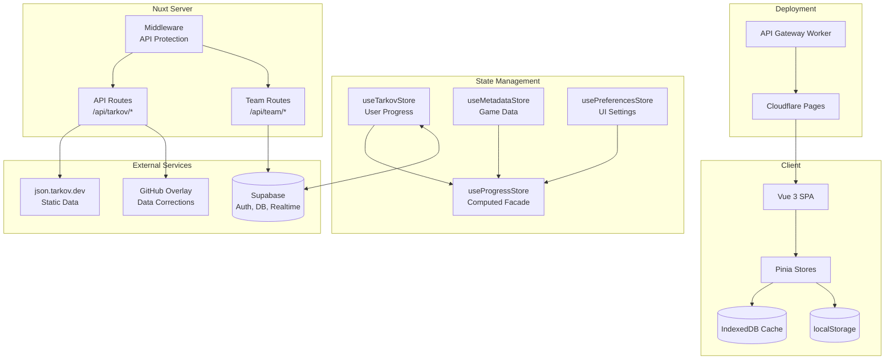
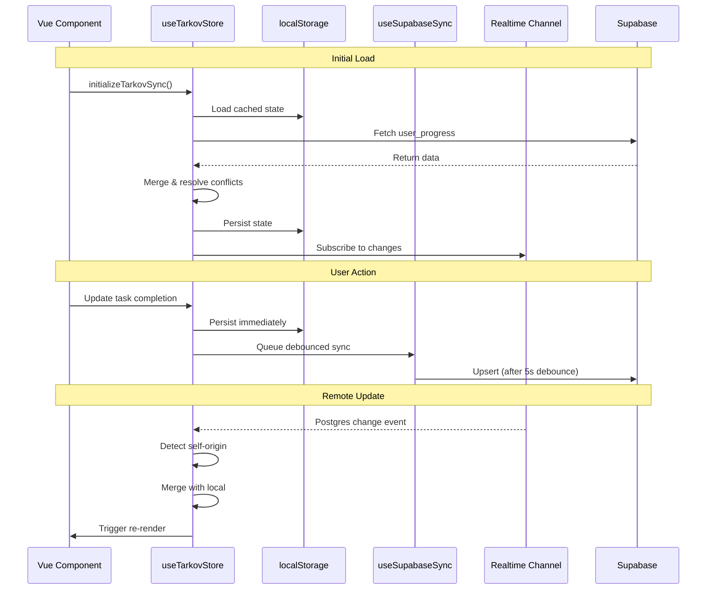
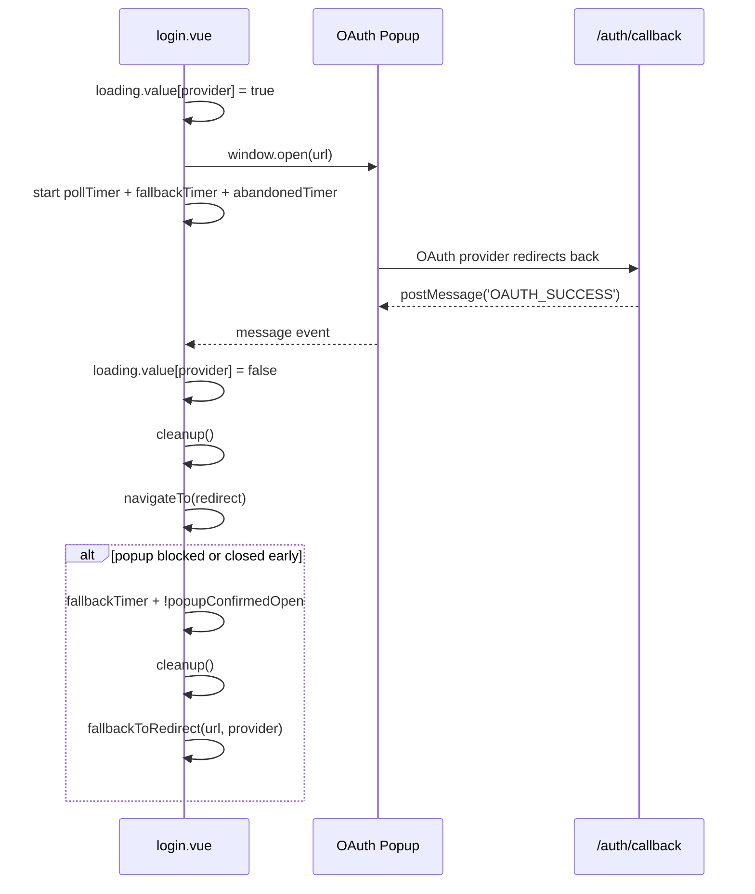
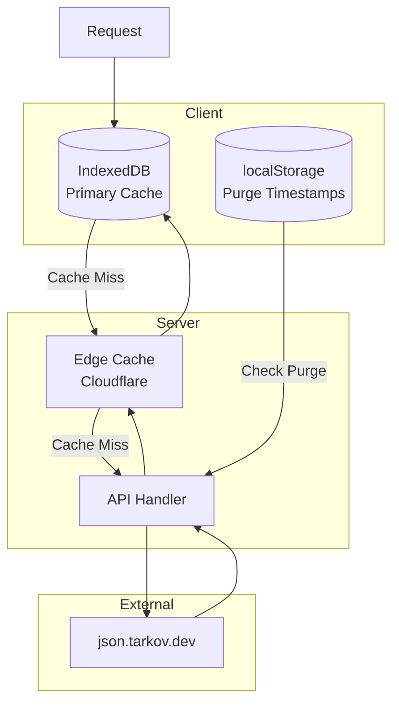

# TarkovTracker Architecture Documentation

## Overview

TarkovTracker is a sophisticated single-page application (SPA) for tracking progress in Escape from Tarkov. Built with Nuxt 4, Vue 3, and Supabase, it provides real-time multi-device synchronization, team collaboration, and comprehensive task/hideout tracking.

## Technology Stack

| Layer             | Technology       | Version  |
| ----------------- | ---------------- | -------- |
| Framework         | Nuxt             | ^4.4.2   |
| UI Library        | Vue 3            | ^3.5.32  |
| Component Library | @nuxt/ui         | ^4.6.1   |
| Styling           | Tailwind CSS     | ^4.2.2   |
| State Management  | Pinia            | ^3.0.4   |
| Backend           | Supabase         | ^2.103.0 |
| Deployment        | Cloudflare Pages | -        |
| Maps              | Leaflet          | ^1.9.4   |
| Graphs            | Vue Flow         | ^1.48.2  |
| i18n              | Vue I18n         | ^11.3.2  |

## Project Structure

```text
/
├── app/                      # Application source (Nuxt srcDir)
│   ├── assets/              # Static assets (CSS, images)
│   ├── components/          # Global UI components
│   ├── composables/         # Reusable composition functions
│   ├── data/                # Static data (maps.json)
│   ├── features/            # Feature modules (domain slices)
│   │   ├── admin/           # Admin dashboard
│   │   ├── dashboard/       # Main dashboard
│   │   ├── drawer/          # Side-drawer and help UI
│   │   ├── hideout/         # Hideout tracking
│   │   ├── maps/            # Interactive maps
│   │   ├── neededitems/     # Required items tracker
│   │   ├── profile/         # Profile and shared progress views
│   │   ├── settings/        # User settings
│   │   ├── storyline/       # Storyline progression
│   │   ├── streamer-tools/  # Streamer overlay tooling
│   │   ├── supporter/       # Supporter/tier management
│   │   ├── tasks/           # Task/quest tracking
│   │   └── team/            # Team collaboration
│   ├── layouts/             # Page layouts
│   ├── locales/             # i18n translations (JSON)
│   ├── pages/               # File-based routing
│   ├── plugins/             # Nuxt plugins
│   ├── server/              # Nitro server routes
│   │   ├── api/             # API endpoints
│   │   ├── middleware/      # Server middleware
│   │   └── utils/           # Server utilities
│   ├── shell/               # App chrome (nav, footer)
│   ├── stores/              # Pinia stores
│   ├── types/               # TypeScript definitions
│   └── utils/               # Utility functions
├── docs/                     # Documentation
├── supabase/                 # Supabase config and functions
├── workers/                  # Cloudflare Workers
│   └── api-gateway/         # Rate limiting gateway
├── nuxt.config.ts           # Nuxt configuration
├── package.json             # Dependencies
└── vitest.config.ts         # Test configuration
```

## Architecture Diagram



## State Management

### Three-Store Pattern + Facade

TarkovTracker uses a **three-store pattern** with Pinia plus a computed facade:

1. **useTarkovStore** - User progress (tasks, hideout, level)
2. **useMetadataStore** - Game data (tasks, items, maps)
3. **usePreferencesStore** - UI settings

**Facade:**

- **useProgressStore** - Computed properties combining all three stores

### Store Responsibilities

#### useTarkovStore (User Progress)

**Location:** `app/stores/useTarkov.ts`

Manages user progress data with dual game mode support (PvP/PvE).

**Key Features:**

- localStorage persistence with user ID validation
- Supabase real-time sync with debouncing (5s)
- Multi-device conflict resolution
- Data migration for legacy formats
- Task repair mechanisms
- Stores a single linked `tarkovUid` for tarkov.dev profiles
- Treats import target mode as import-time UI state, not persisted account metadata

#### Tarkov.dev Linking and Importing

- A linked tarkov.dev account is represented by a single persisted `tarkovUid`.
- The app does **not** persist a long-lived "linked mode" or "imported mode" field.
- Unlinking a tarkov.dev account clears only the saved `tarkovUid`; it does not roll back imported
  progress, profile, skill, level, edition, or prestige fields.
- Refetching a linked profile asks for the profile mode first because PvP, PvE, and future Arena
  profile JSON use the same account id but different tarkov.dev mode routes.
- Tarkov.dev imports always ask the user which mode to write into and default that choice to the
  current active mode.
- The import UI accepts a full `tarkov.dev/players/{regular|pve}/{uid}` profile URL, fetches
  `players.tarkov.dev/profile/{uid}.json` through the public `/api/tarkov-dev/profile` proxy, and
  parses that JSON with the existing Tarkov.dev profile parser.
- The import preview keeps parsed skill values collapsed by default, but exposes the exact
  skill-id and level pairs that will be applied.
- Tarkov.dev only refreshes that public JSON after the user opens their profile page on tarkov.dev,
  so the UI asks users to open the profile before importing.
- Tarkov.dev links use the currently viewed or selected mode only to choose the URL slug:
  `regular` for PvP, `pve` for PvE.
- Legacy embedded `tarkovDevProfile` payloads are sanitized out of stored progress data and should
  not be reintroduced as long-lived state.

#### useMetadataStore (Game Data)

**Location:** `app/stores/useMetadata.ts`

Manages static game data from tarkov.dev API.

**Key Features:**

- Two-phase task loading (core → objectives → rewards)
- IndexedDB caching with TTL
- Graph building for task dependencies
- Item hydration for objectives
- Language-aware data fetching

#### useProgressStore (Computed Facade)

**Location:** `app/stores/useProgress.ts`

Provides computed properties combining all stores.

**Key Computed Properties:**

- `tasksCompletions` - Per-team task completion status
- `unlockedTasks` - Task availability considering prerequisites
- `hideoutLevels` - Current hideout progression
- `objectiveCompletions` - Task objective progress
- `invalidTasks` - Data consistency validation

## Data Synchronization

### Supabase Sync Flow



### Conflict Resolution Strategy

1. **Sticky Complete Semantics**: Once a task is marked complete, it stays complete unless explicitly set to false
2. **Timestamp-Based Merging**: Newer entries take precedence
3. **Max Value Preservation**: For counts and levels, keep the higher value
4. **Self-Origin Filtering**: Ignore echoed updates from own device (< 3s threshold)

## Authentication

### OAuth Popup Flow (Login)

- Initial conditions:
  - `loading.value[provider]` is set to `true` before popup open.
  - `popupConfirmedOpen` starts as `false`.
  - `pollTimer`, `fallbackTimer`, and `abandonedTimer` are created.
- `pollTimer` runs every 500ms; if the popup closes, it clears `loading.value[provider]` and runs
  `cleanup()`, otherwise it sets `popupConfirmedOpen`.
- `fallbackTimer` runs at 3s; if `didCleanup` is false, loading is still active, the popup was never
  confirmed open, and the popup is missing or closed, it runs `cleanup()` and then
  `fallbackToRedirect(url, provider)`.
- `abandonedTimer` runs at 90s; if `didCleanup` is still false, it clears `loading.value[provider]` and
  runs `cleanup()` to abort the flow.
- Success path: on `OAUTH_SUCCESS` message from the popup, it clears `loading.value[provider]`, runs
  `cleanup()`, and navigates to the safe redirect.
- `popupConfirmedOpen` tracks whether the popup has been detected as open at least once to avoid
  triggering the redirect fallback unnecessarily.
- `loading.value[provider]` acts as the gate for the fallback timer; if loading is cleared, fallback exits.
- `cleanup()` clears timers, removes the message listener, and attempts to close the popup safely.



### Supabase Authentication

1. User authenticates via Supabase (OAuth/email)
2. JWT stored in session
3. Protected routes validate token
4. Team API validates membership

## API Architecture

### Tarkov Data API

All game data is fetched through Nuxt server routes that proxy to `json.tarkov.dev` static data.

| Endpoint                       | Purpose              | Cache TTL |
| ------------------------------ | -------------------- | --------- |
| `/api/tarkov/bootstrap`        | Player levels        | 12h       |
| `/api/tarkov/tasks-core`       | Tasks, maps, traders | 12h       |
| `/api/tarkov/tasks-objectives` | Task objectives      | 12h       |
| `/api/tarkov/tasks-rewards`    | Task rewards         | 12h       |
| `/api/tarkov/hideout`          | Hideout stations     | 12h       |
| `/api/tarkov/items-lite`       | Items (minimal)      | 24h       |
| `/api/tarkov/items`            | Items (full)         | 24h       |
| `/api/tarkov/prestige`         | Prestige levels      | 24h       |
| `/api/tarkov/map-spawns`       | Map spawn points     | 12h       |
| `/api/tarkov/cache-meta`       | Cache purge status   | no-store  |

### Team API

| Endpoint            | Method | Purpose                    |
| ------------------- | ------ | -------------------------- |
| `/api/team/members` | GET    | Fetch team member profiles |

### Caching Strategy



## Security

### API Protection

```typescript
// nuxt.config.ts
runtimeConfig: {
  apiProtection: {
    allowedHosts: process.env.API_ALLOWED_HOSTS,
    trustedIpRanges: process.env.API_TRUSTED_IP_RANGES,
    requireAuth: process.env.API_REQUIRE_AUTH !== 'false',
    publicRoutes: '/api/tarkov/*,/api/tarkov-dev/profile',
    trustProxy: resolveTrustProxySetting({
      API_TRUST_PROXY: process.env.API_TRUST_PROXY,
      NITRO_PRESET: process.env.NITRO_PRESET,
    }),
  }
}
```

## Performance Optimizations

1. **IndexedDB Caching**: Reduce network requests
2. **Idle Task Scheduling**: Defer non-critical fetches
3. **Graph Building**: O(1) task dependency lookups
4. **Memoization**: Cache computed values
5. **Incremental List Loading**: Load long item/task lists progressively
6. **Manual Chunks**: Separate vendor bundles

## Testing

**Framework:** Vitest + Vue Test Utils

```bash
# Run all tests
npm run test

# Watch mode
npm run test:watch

# API Gateway tests
npm run test:api-gateway
```

**Test Organization:**

- Unit tests: `app/**/__tests__/*.test.ts`
- Mock strategy: Supabase client, network requests
- DOM environment: happy-dom

## Deployment

### Cloudflare Pages

```yaml
Build command: npm run build
Build output: dist
Root directory: /
Node.js version: 24.x
```

### Environment Variables

Naming convention: `NUXT_*` for Nuxt private runtime config (server-only), `NUXT_PUBLIC_*`
for Nuxt public runtime config (browser-exposed), plain names for platform/build-time or
Supabase Edge Functions.

Full resolution logic is in `app/utils/runtimeConfig.ts`.

**Client-side (browser) — Nuxt public runtime config:**

| Variable                        | Description                            | Required   |
| ------------------------------- | -------------------------------------- | ---------- |
| `NUXT_PUBLIC_SUPABASE_URL`      | Supabase project URL for auth and sync | Yes¹       |
| `NUXT_PUBLIC_SUPABASE_ANON_KEY` | Supabase anon key for auth and sync    | Yes¹       |
| `NUXT_PUBLIC_APP_URL`           | Application URL                        | Yes (prod) |

> **¹ Required in production.** `SUPABASE_URL` and `SUPABASE_ANON_KEY` work as cross-platform
> build-time fallbacks. Without Supabase configuration, auth, sync, realtime, and team features
> are unavailable; the app runs in offline mode with localStorage only.

**Server-side (Nuxt private runtime config):**

| Variable                           | Description                                       | Required   |
| ---------------------------------- | ------------------------------------------------- | ---------- |
| `NUXT_SUPABASE_SERVICE_KEY`        | Supabase service role key                         | Yes (prod) |
| `NUXT_TARKOV_JSON_BASE_URL`        | Static game-data JSON base URL override           | No         |
| `NUXT_LOG_SINK_URL`                | Centralized server log sink (HTTPS)               | No         |
| `NUXT_TWITCH_CLIENT_ID`            | Twitch API client ID                              | No         |
| `NUXT_GITHUB_CONTRIBUTORS_EXCLUDE` | Bot accounts excluded from contributors           | No         |
| `NUXT_GITHUB_TIMEOUT_MS`           | GitHub API timeout                                | No         |
| `NUXT_CACHE_BYPASS_ENABLED`        | Enable server-side cache bypass header            | No         |
| `API_ALLOWED_HOSTS`                | Allowed origin hosts                              | No         |
| `API_TRUSTED_IP_RANGES`            | Trusted IP ranges (CIDR)                          | No         |
| `API_REQUIRE_AUTH`                 | Require auth for protected routes (default true)  | No         |
| `API_PUBLIC_ROUTES`                | Routes exempt from auth                           | No         |
| `API_TRUST_PROXY`                  | Trust proxy headers (auto-detected on Cloudflare) | No         |
| `STRIPE_SECRET_KEY`                | Stripe API secret key                             | Yes (prod) |
| `STRIPE_PRICE_SCAV_MONTHLY`        | Stripe price ID for Scav monthly plan             | Yes (prod) |
| `STRIPE_PRICE_SCAV_6MONTH`         | Stripe price ID for Scav 6-month plan             | Yes (prod) |
| `STRIPE_PRICE_SCAV_YEARLY`         | Stripe price ID for Scav yearly plan              | Yes (prod) |
| `STRIPE_PRICE_TIMMY_MONTHLY`       | Stripe price ID for Timmy monthly plan            | Yes (prod) |
| `STRIPE_PRICE_TIMMY_6MONTH`        | Stripe price ID for Timmy 6-month plan            | Yes (prod) |
| `STRIPE_PRICE_TIMMY_YEARLY`        | Stripe price ID for Timmy yearly plan             | Yes (prod) |
| `STRIPE_PRICE_CHAD_MONTHLY`        | Stripe price ID for Chad monthly plan             | Yes (prod) |
| `STRIPE_PRICE_CHAD_6MONTH`         | Stripe price ID for Chad 6-month plan             | Yes (prod) |
| `STRIPE_PRICE_CHAD_YEARLY`         | Stripe price ID for Chad yearly plan              | Yes (prod) |

**Build-time / platform:**

| Variable             | Description                     |
| -------------------- | ------------------------------- |
| `APP_URL`            | App URL (CF Pages / CI)         |
| `CF_PAGES_URL`       | Cloudflare Pages deploy URL     |
| `GA_MEASUREMENT_ID`  | Google Analytics measurement ID |
| `CLARITY_PROJECT_ID` | Microsoft Clarity project ID    |
| `GITHUB_TOKEN`       | GitHub API token                |

**Supabase Edge Functions** (set in Supabase Dashboard, not Cloudflare Pages):

`SUPABASE_URL`, `SUPABASE_ANON_KEY`, `SUPABASE_SERVICE_ROLE_KEY` — all canonical for Edge
Functions. (`SUPABASE_SERVICE_ROLE_KEY` is deprecated only as a Nuxt app fallback; use
`NUXT_SUPABASE_SERVICE_KEY` for Nuxt.) `STRIPE_SECRET_KEY` and `STRIPE_WEBHOOK_SECRET` are shared
canonical names used by both Nuxt and Edge Functions. `DISCORD_BOT_TOKEN`, `DISCORD_GUILD_ID`,
`DISCORD_SUPPORTER_ROLE_ID`, `CLOUDFLARE_ZONE_ID`, `CLOUDFLARE_API_TOKEN` are Edge-only.
See `supabase/functions/.env.example`.

## Code Conventions

- **Indent:** 2 spaces
- **Line width:** 100 characters
- **Strings:** Single quotes
- **Semicolons:** Always
- **Imports:** Use `@/` alias
- **Components:** PascalCase
- **Colors:** Tailwind tokens only (no hex)
- **Comments:** Only where necessary
