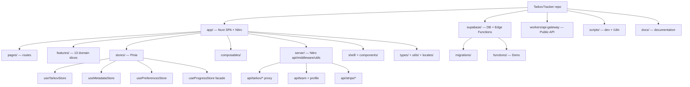

# Codebase Information — TarkovTracker

> Auto-generated baseline analysis of the TarkovTracker repository. Pairs with the
> authoritative `docs/ARCHITECTURE.md` and `docs/API.md`. When this file disagrees with
> executable config (`nuxt.config.ts`, `eslint.config.mjs`, `package.json`) or those docs,
> trust the config and source.

## What This Project Is

TarkovTracker is a single-page application (SPA) for tracking progress in _Escape from Tarkov_:
quest/task completion, hideout upgrades, needed items, player level, skills, prestige, interactive
maps, and real-time team collaboration. It supports dual game modes (PvP `regular` and PvE `pve`)
and multi-device sync.

## Technology Stack

| Layer      | Technology                                   | Notes                                    |
| ---------- | -------------------------------------------- | ---------------------------------------- |
| Framework  | Nuxt 4 (`ssr: false`)                        | SPA-only; no SSR-only features           |
| UI         | Vue 3 Composition API + `@nuxt/ui`           | `<script setup lang="ts">`               |
| Styling    | Tailwind CSS v4                              | No `<style>` blocks; theme tokens only   |
| State      | Pinia + `pinia-plugin-persistedstate`        | Three-store pattern + computed facade    |
| Backend    | Supabase                                     | Auth, Postgres, Realtime, Edge Functions |
| Game data  | `json.tarkov.dev` (proxied)                  | Static JSON via Nitro server routes      |
| Maps       | Leaflet                                      | Custom CRS, SVG/tile floor handling      |
| Graphs     | Vue Flow                                     | Task/hideout dependency graphs           |
| i18n       | Vue I18n + `@nuxtjs/i18n`                    | Crowdin-managed locales                  |
| Public API | Cloudflare Worker (`workers/api-gateway`)    | Token auth + Durable Object rate limiter |
| Payments   | Stripe                                       | Supporter subscriptions + one-time       |
| Tests      | Vitest + Vue Test Utils + `@nuxt/test-utils` | happy-dom environment                    |
| Deploy     | Cloudflare Pages/Workers                     | Node `>=24.12.0`, npm `>=11.6.2`         |

**Languages:** TypeScript (strict) is dominant for app, server, workers; Vue SFCs for components;
Deno/TypeScript for Supabase Edge Functions; small Node `.mjs` scripts; SQL migrations; shell scripts.

## Top-Level Layout

```text
/
├── app/              # Nuxt srcDir — all client + Nitro server code
├── supabase/         # config.toml, migrations/, functions/ (Deno edge functions)
├── workers/          # Cloudflare Workers (api-gateway)
├── scripts/          # Node/shell dev + i18n + setup scripts
├── docs/             # Project documentation (ARCHITECTURE.md, API.md, agent-context/)
├── public/           # Static assets (incl. llms.txt)
├── nuxt.config.ts    # Nuxt + Nitro + runtimeConfig + security
├── eslint.config.mjs # Flat ESLint config (zero-warning policy)
├── wrangler.toml     # Cloudflare Pages/Worker config
└── package.json      # Scripts, deps, engines, lint-staged
```

## `app/` Module Map

```text
app/
├── pages/            # File-based routes (index, tasks, hideout, needed-items, team,
│                     #   settings, profile/[userId], login, auth/callback, oauth/consent, ...)
├── features/         # Domain slices (see table below)
├── shell/            # App chrome: AppBar, NavDrawer, AppFooter, LoadingScreen
├── components/       # Global shared UI (ui/, analytics/)
├── stores/           # Pinia stores + tarkov/ and preferences/ submodules
├── composables/      # Reusable composition fns (+ api/, supabase/ subfolders)
├── plugins/          # Client plugins, numbered for load order (NN.*.client.ts)
├── server/           # Nitro server: api/, middleware/, routes/, utils/
├── middleware/       # Route middleware (auth, admin)
├── types/            # TypeScript definitions (tarkov.ts, progress.ts, ...)
├── utils/            # Client/shared utilities
├── data/             # Static data (maps.json, overrides)
├── locales/          # i18n JSON (en.json is source; others Crowdin-owned)
├── layouts/          # Page layouts (default.vue)
├── assets/css/       # tailwind.css (theme + keyframes)
├── app.vue / error.vue / app.config.ts / i18n.config.ts
```

### Feature Slices (`app/features/`)

| Slice            | Responsibility                                                        |
| ---------------- | --------------------------------------------------------------------- |
| `admin`          | Admin dashboard: cache purge, supporter access, audit log             |
| `dashboard`      | Home dashboard: progress cards, next actions, trader cards, changelog |
| `drawer`         | Side navigation drawer, level controls, game settings                 |
| `hideout`        | Hideout station/module tracking and requirements                      |
| `kappa`          | Kappa container quest-chain overview                                  |
| `maps`           | Interactive Leaflet maps with objective markers                       |
| `neededitems`    | Aggregated required items across tasks + hideout                      |
| `profile`        | Profile and shared/public progress views                              |
| `settings`       | User settings, data management, API tokens, prestige, skills          |
| `storyline`      | Storyline chapter progression                                         |
| `streamer-tools` | Streamer overlay configuration                                        |
| `supporter`      | Supporter tiers, pricing, Stripe entry points                         |
| `tasks`          | Task/quest tracking, filtering, graph view, objectives                |
| `team`           | Team creation, invites, members                                       |

## State Management — Three Stores + Facade

| Store                 | File                           | Role                                                                          |
| --------------------- | ------------------------------ | ----------------------------------------------------------------------------- |
| `useTarkovStore`      | `app/stores/useTarkov.ts`      | User progress (tasks, hideout, level, prestige); localStorage + Supabase sync |
| `useMetadataStore`    | `app/stores/useMetadata.ts`    | Static game data; IndexedDB cache; graph building                             |
| `usePreferencesStore` | `app/stores/usePreferences.ts` | UI settings/filters; synced to `user_preferences`                             |
| `useProgressStore`    | `app/stores/useProgress.ts`    | Computed facade combining the above                                           |
| `useTeamStore`        | `app/stores/useTeamStore.ts`   | Team membership + teammate progress                                           |
| `useSystemStore`      | `app/stores/useSystemStore.ts` | Session/system state (user_id, tokens, team, admin)                           |
| `useApp`              | `app/stores/useApp.ts`         | Drawer/UI chrome state                                                        |

`progressState.ts` holds the low-level progress mutation logic shared by the tarkov store.
`app/stores/tarkov/` contains sync/merge internals (realtime listener, progress merge, prestige,
hideout prereqs, conflict detection, reset engine).

## Server (Nitro) Surface (`app/server/`)

- `api/tarkov/*` — proxy endpoints to `json.tarkov.dev` (bootstrap, tasks-core, tasks-objectives,
  tasks-rewards, hideout, items, items-lite, prestige, map-spawns, cache-meta).
- `api/team/members` — team member profiles (auth required).
- `api/profile/[userId]/[mode].get.ts` — shared/public profile fetch (in-memory cache + rate limit).
- `api/stripe/{checkout,portal}.post.ts` — Stripe Checkout + Customer Portal sessions.
- `api/admin/supporter.post.ts` — admin supporter management.
- `api/tarkov-dev/profile.get.ts` — proxy to `players.tarkov.dev` profile JSON.
- `api/streamer/[userId]/[mode]/kappa.get.ts`, `api/twitch/live.get.ts`,
  `api/changelog.get.ts`, `api/contributors.get.ts`, `api/logs/*`.
- `routes/overlay/kappa/[userId]/[mode].get.ts` — server-rendered streamer overlay.
- `middleware/api-protection.ts` — CORS, auth-token validation, host/IP allowlisting, public routes.
- `utils/` — `tarkov-json.ts` (json.tarkov.dev adapters), `overlay.ts` (community data corrections),
  `edgeCache.ts`, `sharedEdgeStore.ts`, `streamerKappa.ts`, sanitizers.

## Supabase (`supabase/`)

- `config.toml` — local stack config.
- `migrations/` — SQL schema, RLS policies, RPCs (user_progress, user_system, user_preferences,
  teams/team_memberships, api_tokens, supporters, stripe_events, account deletion jobs, prestige runs).
- `functions/` — Deno Edge Functions:
  - Team: `team-create`, `team-join`, `team-leave`, `team-kick`, `team-members`.
  - Tokens: `token-create`, `token-revoke`.
  - Account: `account-delete`, `account-delete-reconcile`.
  - Billing: `stripe-webhook` (also Discord role sync).
  - Ops: `admin-cache-purge`.
  - `_shared/` — `auth.ts`, `cors.ts`, `discord.ts`, `rate-limit.ts`, generated `database.types.ts`.

## Cloudflare Worker (`workers/api-gateway/`)

Public token-authenticated API. `src/index.ts` defines the `ApiGatewayRateLimiter` Durable Object
and request routing; `src/handlers/{progress,team,token}.ts` implement endpoints; `src/auth.ts`
validates SHA-256 hashed API tokens; `src/openapi.ts` holds the OpenAPI spec
(`npm run validate:openapi`).

## Codebase Map (Hierarchical)



## Build, Test, and Quality Tooling

| Concern            | Tooling                                                                      |
| ------------------ | ---------------------------------------------------------------------------- |
| Package manager    | npm `>=11.6.2` (`packageManager: npm@11.16.0`), Node `>=24.12.0`             |
| Dev/build          | `nuxt dev`, `nuxt build`, `nuxt generate`, `nuxt preview`                    |
| Lint               | ESLint flat config (`eslint app --max-warnings=0`) + DESIGN.md lint          |
| Format             | Prettier (+ `prettier-plugin-tailwindcss`), enforced via husky + lint-staged |
| Typecheck          | `nuxt typecheck` (vue-tsc)                                                   |
| Tests              | Vitest (root + `workers/api-gateway` config)                                 |
| i18n lint          | `scripts/lint-i18n.mjs` (snake_case enforcement)                             |
| Unused code        | `knip`                                                                       |
| Dependency updates | `taze`                                                                       |
| Commit hygiene     | commitlint (conventional), husky hooks                                       |
| Release            | semantic-release                                                             |

## Where to Look First

- **App behavior / data flow:** `docs/ARCHITECTURE.md`, then the relevant store in `app/stores/`.
- **HTTP endpoints:** `docs/API.md`, then `app/server/api/`.
- **Data shapes:** `app/types/tarkov.ts` (game data) and `app/types/progress.ts` (user progress).
- **Conventions / guardrails:** root `AGENTS.md` and `docs/agent-context/`.
