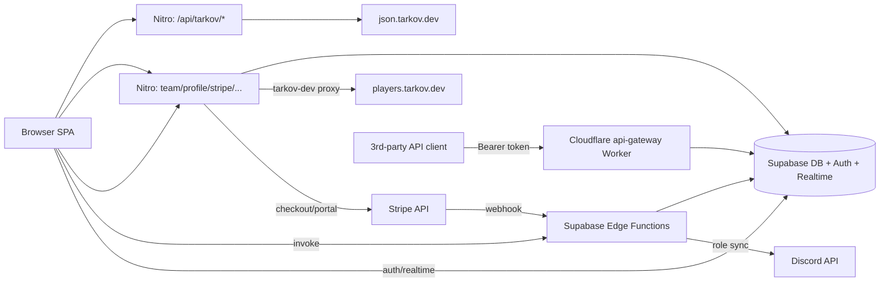
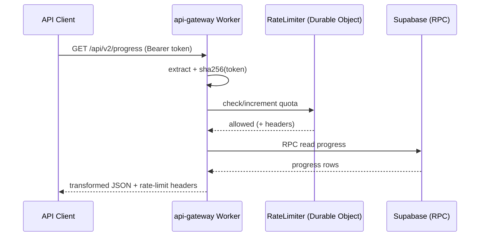

# Interfaces — TarkovTracker

> APIs, interfaces, and integration points. The authoritative endpoint reference (with full
> request/response examples) is `docs/API.md`. This file summarizes the surface and the boundaries
> between subsystems.

## Interface Map

## 1. Nitro Game-Data Endpoints (`/api/tarkov/*`)

Public, cached proxies to `json.tarkov.dev` with overlay corrections. Common query params:
`lang` (default `en`), `gameMode` (`regular` | `pve`, where applicable), `cacheBust=1` to bypass.

| Endpoint                           | Returns                                                 | Cache TTL |
| ---------------------------------- | ------------------------------------------------------- | --------- |
| `GET /api/tarkov/bootstrap`        | Player levels (minimal)                                 | 12h       |
| `GET /api/tarkov/tasks-core`       | Tasks, maps, traders                                    | 12h       |
| `GET /api/tarkov/tasks-objectives` | Task objectives + fail conditions                       | 12h       |
| `GET /api/tarkov/tasks-rewards`    | Task rewards (start/finish/failure)                     | 12h       |
| `GET /api/tarkov/hideout`          | Hideout stations + requirements + crafts                | 12h       |
| `GET /api/tarkov/items-lite`       | Items (id, name, shortName, image)                      | 24h       |
| `GET /api/tarkov/items`            | Full item data                                          | 24h       |
| `GET /api/tarkov/prestige`         | Prestige levels (sourced from `regular`, lang-only key) | 24h       |
| `GET /api/tarkov/map-spawns`       | Map spawn points                                        | 12h       |
| `GET /api/tarkov/cache-meta`       | Server purge timestamp                                  | no-store  |

Responses are wrapped as `{ "data": { ... } }`. See `docs/API.md` for shapes.

## 2. Nitro Application Endpoints

| Endpoint                              | Method | Auth                  | Purpose                                                   |
| ------------------------------------- | ------ | --------------------- | --------------------------------------------------------- |
| `/api/team/members?teamId=`           | GET    | Supabase JWT          | Team member profiles                                      |
| `/api/profile/[userId]/[mode]`        | GET    | Public (rate limited) | Shared/public profile progress                            |
| `/api/tarkov-dev/profile?...`         | GET    | Public (rate limited) | Proxy to `players.tarkov.dev/profile/{uid}.json`          |
| `/api/stripe/checkout`                | POST   | Supabase JWT          | Create Stripe Checkout session (subscription or one-time) |
| `/api/stripe/portal`                  | POST   | Supabase JWT          | Create Stripe Customer Portal session                     |
| `/api/admin/supporter`                | POST   | Admin                 | Manage supporter access                                   |
| `/api/streamer/[userId]/[mode]/kappa` | GET    | Public                | Streamer kappa data                                       |
| `/api/twitch/live`                    | GET    | Public                | Twitch live status                                        |
| `/api/changelog`                      | GET    | Public                | Changelog feed                                            |
| `/api/contributors`                   | GET    | Public                | Contributors list (GitHub)                                |
| `/overlay/kappa/[userId]/[mode]`      | GET    | Public                | Server-rendered streamer overlay (under `server/routes`)  |

### Stripe request bodies (summary)

- Checkout (subscription): `{ mode: "subscription", tier: "scav"|"timmy"|"chad", interval: "monthly"|"6month"|"yearly" }`
- Checkout (one-time): `{ mode: "payment", amount: <1..999> }`
- Portal: `{ returnUrl?: <absolute URL on app origin> }` — host must match app URL or it falls back to `${appUrl}/supporter`.

## 3. Public API Gateway (Cloudflare Worker)

`workers/api-gateway` — a standalone REST API for third-party clients, authenticated by
**Bearer API tokens** (SHA-256 hashed; created/revoked via Edge Functions). It uses a Durable
Object (`ApiGatewayRateLimiter`) for rate limiting and ships an OpenAPI document
(`workers/api-gateway/src/openapi.ts`, validated by `npm run validate:openapi`).

Handlers: `progress.ts` (get/update tasks, objective, level), `team.ts` (team progress),
`token.ts` (token info). Consult `openapi.ts` for the exact route/version contract.

## 4. Supabase Edge Functions (invoked from client / Stripe)

Invoked via `app/composables/api/useEdgeFunctions.ts` (or Stripe webhooks). All use
`_shared/auth.ts` for auth + CORS and `_shared/rate-limit.ts` (RPC) for per-user limits.

| Function                                                                  | Trigger      | Purpose                                    |
| ------------------------------------------------------------------------- | ------------ | ------------------------------------------ |
| `team-create` / `team-join` / `team-leave` / `team-kick` / `team-members` | Client       | Team lifecycle                             |
| `token-create` / `token-revoke`                                           | Client       | API token management                       |
| `account-delete` / `account-delete-reconcile`                             | Client / job | Account deletion                           |
| `stripe-webhook`                                                          | Stripe       | Supporter grant/revoke + Discord role sync |
| `admin-cache-purge`                                                       | Admin client | Purge Cloudflare + data caches             |

## 5. External Integrations

| Integration                          | Direction               | Notes                                                           |
| ------------------------------------ | ----------------------- | --------------------------------------------------------------- |
| `json.tarkov.dev`                    | Outbound (server)       | Static game data; override base via `NUXT_TARKOV_JSON_BASE_URL` |
| `tarkov-data-overlay` (GitHub)       | Outbound (server)       | Community data corrections (`overlay.ts`)                       |
| `players.tarkov.dev`                 | Outbound (server proxy) | Profile import JSON                                             |
| Supabase                             | Bidirectional           | Auth, DB, Realtime, Edge Functions                              |
| Stripe                               | Outbound + webhook      | Supporter payments                                              |
| Discord                              | Outbound (edge)         | Supporter role sync                                             |
| Twitch / GitHub                      | Outbound (server)       | Live status / contributors                                      |
| Google Analytics / Microsoft Clarity | Client (consent-gated)  | Product analytics                                               |

## Error Conventions

Nitro endpoints return errors as `{ error, statusCode, statusMessage }`. Typical statuses:
`400` (bad params), `401` (missing/invalid token), `403` (not a team member / not admin),
`404` (no Stripe customer), `5xx`/`502` (upstream/config failures). See `docs/API.md` for the
per-endpoint error tables.
